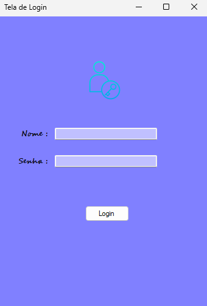
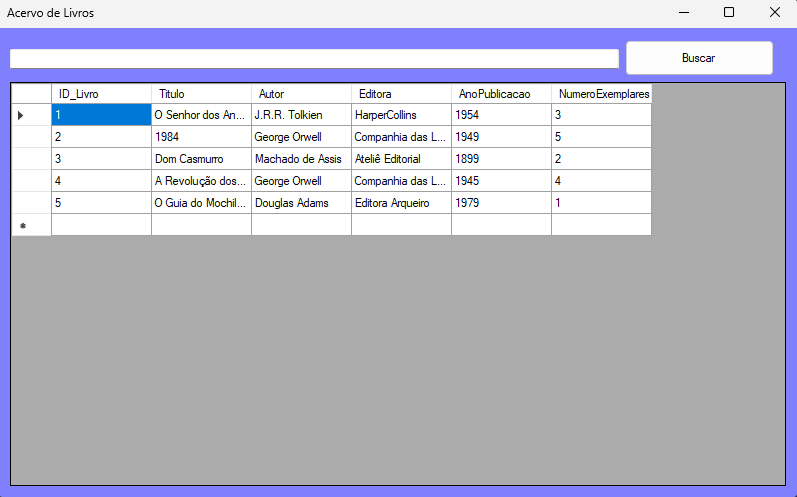
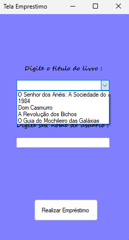
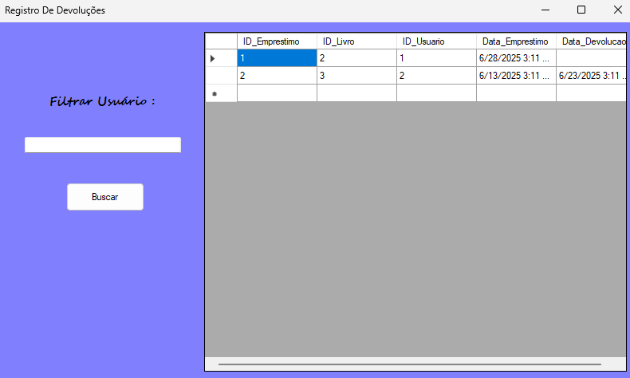

# 📚 Sistema de Gerenciamento de Biblioteca

  

Aplicativo desktop completo para Windows, desenvolvido em **C# com Windows Forms** e **SQL Server**, simulando um sistema de gerenciamento para uma biblioteca. Este projeto foi desenvolvido como um exercício prático de programação orientada a objetos, manipulação de banco de dados com ADO.NET e design de interfaces.

---

## ✨ Funcionalidades

O sistema conta com um robusto conjunto de funcionalidades, incluindo:

*   **Autenticação de Usuários:** Tela de login que diferencia usuários comuns de funcionários.
*   **Cadastro Completo:**
    *   Módulo para **Cadastro de Usuários**.
    *   Módulo para **Cadastro de Livros** no acervo.
*   **Gerenciamento de Operações:**
    *   Sistema para **Registro de Empréstimos**, vinculando um livro a um usuário.
    *   Módulo para **Gerenciamento e Registro de Devoluções**.
*   **Consulta e Visualização:** Tela para consulta do acervo de livros com funcionalidade de pesquisa.

---

## 💻 Tecnologias Utilizadas

*   **Linguagem:** C#
*   **Plataforma:** .NET Framework 4.7.2
*   **Interface Gráfica:** Windows Forms
*   **Banco de Dados:** SQL Server Express
*   **Acesso a Dados:** ADO.NET (SqlConnection, SqlCommand, etc.)
*   **IDE:** Visual Studio 2022

---

## 📸 Telas do Sistema

**Tela de Login e Registro de Usuário**




**Gerenciamento de Livros**



**Operações de Empréstimo e Devolução**






---

## 🚀 Como Executar o Projeto

Para clonar e executar este projeto em sua máquina local, siga os passos abaixo.

**Pré-requisitos:**
*   **Visual Studio 2022** (com a carga de trabalho "Desenvolvimento para desktop com .NET" instalada).
*   **SQL Server Express Edition** (qualquer versão a partir de 2019).
*   **SQL Server Management Studio (SSMS)**.

**Passos para Instalação:**
1.  Clone este repositório para a sua máquina:
    ```bash
    git clone https://github.com/Guh13/Sistema_Biblioteca.git
    ```
2.  Abra o **SQL Server Management Studio (SSMS)**:
    *   Conecte-se à sua instância local (`localhost\SQLEXPRESS`).
    *   **IMPORTANTE:** Certifique-se de que a sua janela de consulta está conectada ao banco de dados `master`.
    *   Abra o arquivo `script_banco.sql` (ou crie um novo) e execute o script SQL completo para criar o banco de dados `BibliotecaDB` e todas as tabelas necessárias.
    *   **(Dica: Coloque o último script SQL que te passei em um arquivo `script_banco.sql` na raiz do seu projeto. Fica super profissional!)**

3.  Abra a solução **`Biblioteca.sln`** no Visual Studio 2022.

4.  O projeto já está configurado para usar a autenticação do Windows. Pressione **F5** ou clique no botão "Iniciar" (▶️) para compilar e executar a aplicação.

---

## 👨‍💻 Autor

**Gustavo Oliveira Moreira**

*   GitHub: [@Guh13](https://github.com/Guh13)
*   Email: `gustavo13.dev@gmail.com`
